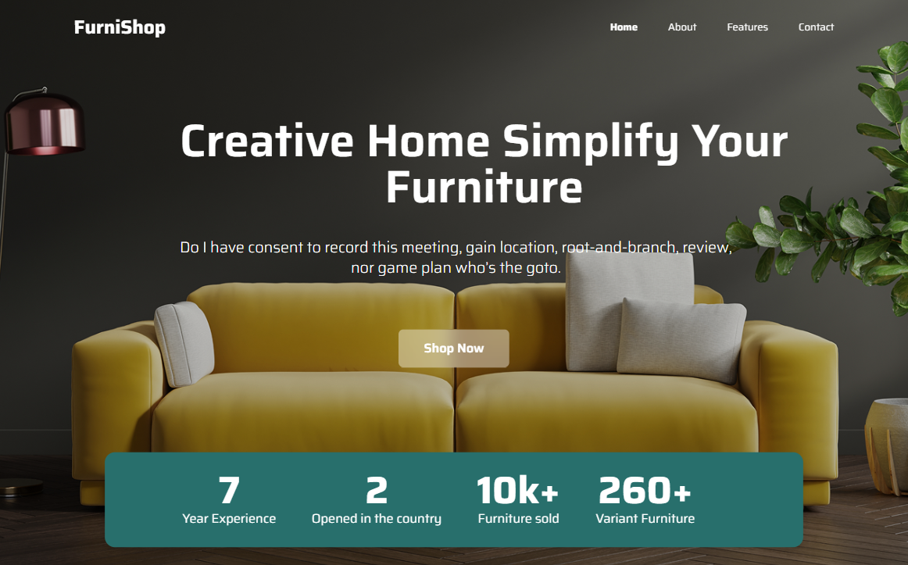
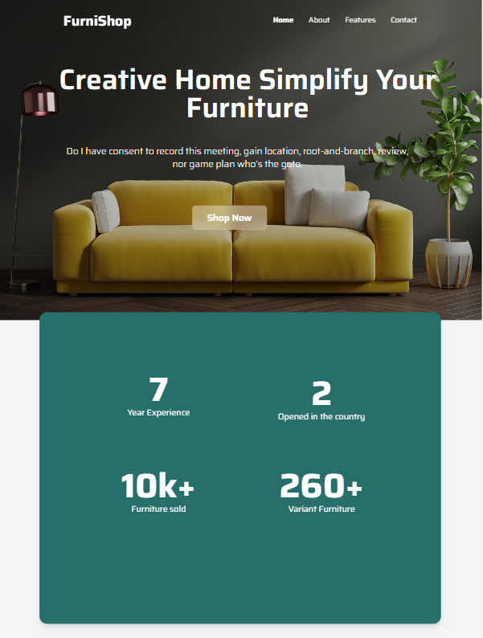
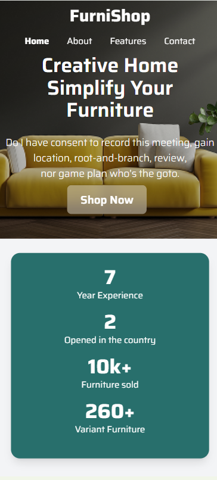

# Furnishop

Este é um projeto de uma landing page responsiva feita com **HTML5** e **Tailwind CSS**, com foco em design moderno para uma loja de móveis fictícia chamada **FurniShop**, para a entrega de atividade final do primeiro semestre do curso de Desenvolvimento de Sistemas.

---

## Funcionalidades
**- Responsivo:** Funciona em desktop, tablet e mobile.
**- Estilo com Tailwind CSS:** Utilização de utilitários para layout, espaçamentos, fontes e efeitos.
**- Design moderno:** Tipografia personalizada (Google Fonts), imagens de fundo, gradientes e mais.

---

## 📸 Prévia do projeto

### Desktop: (1440x900)

### Tablet (1024x1366)

### Mobile (393x852)

[link do figma](https://www.figma.com/design/qkxZ7EEgAz5ohLUegcg4gS/lima---FurniShop--Copy-?m=auto&t=dGLScsMG1NTYNMOv-1)

---

## Como rodar o projeto

**1-Clone o repositório:**

git clone https://github.com/mariacecilia-01/furnishop.git

**2-Acesse a pasta do projeto:**

cd furnishop

**Abra no Visual Studio Code:**

code .

**Execute no navegador:**

Clique com o botão direito no index.html > Open with Live Server

---

## Tecnologias Utilizadas

- HTML5
- Tailwind CSS
- Google Fonts (Fonte Saira)
- Imagens em formato PNG/SVG

## Autora
Feito com 💛 por Maria Cecília Pereira Jardim
**GitHub:** @mariacecilia-01